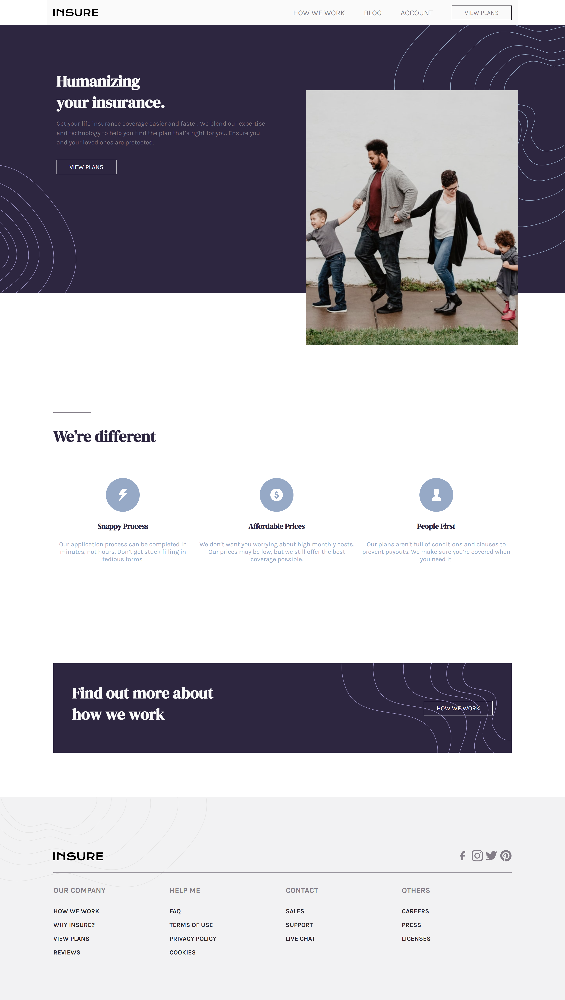

# Insure landing page

This is a solution to the [Insure landing page challenge on Frontend Mentor](https://www.frontendmentor.io/challenges/insure-landing-page-uTU68JV8). Frontend Mentor challenges help you improve your coding skills by building realistic projects.

## The challenge

Users should be able to:

- View the optimal layout for the site depending on their device's screen size
- See hover states for all interactive elements on the page

## Screenshot

## Links

- Live Site URL: [view here](https://codereme.github.io/css-landing-pages/insure-landing-page/index.html)

## Author

- Frontend Mentor - [@codereme](https://www.frontendmentor.io/profile/codereme)
- Github - [@codereme](https://github.com/codereme)
